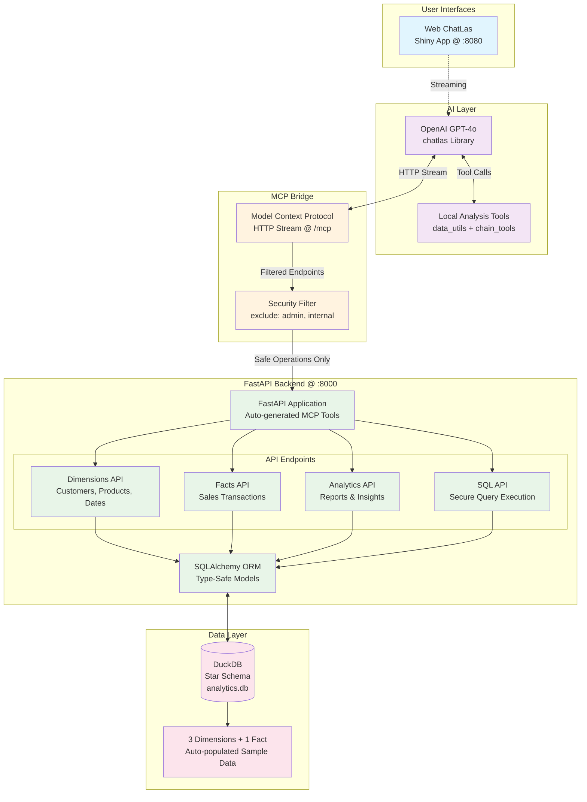

# From UI to U-AI

A proof-of-concept repo featuring a **FastAPI backend** with **DuckDB SQL database (star schema)**, **FastAPI -> MCP (Model Context Protocol) integration**, and **AI-powered Chatbot Shiny Interface** for natural language data retrieval.

This PoC proves that **any organization** with SQL database and FastAPI can:

1. **Deploy secure NLP interfaces** in hours, not months
2. **Maintain existing security models** while adding AI capabilities
3. **Leverage cutting-edge AI** without compromising data security

**ChatLas + FastAPI MCP transforms the question from:**
*"How do we build AI data access?"*

**To:**
*"Which endpoints should we expose to AI first?"*

## 🏗️ Architecture Overview



### 🔧 Backend (FastAPI + DuckDB)
- **Star schema** data warehouse (3 dimension tables + 1 fact table)
- **FastAPI** REST API with **MCP integration**
- **DuckDB** analytical database with **SQLAlchemy ORM**
- **Secure SQL endpoint** with query validation
- **Comprehensive test suite** with pytest

### 🤖 Frontend (ChatLas + Shiny Web App)
- **OpenAI GPT-4o** powered analytics assistant
- **MCP tools integration** for seamless API access
- **Real-time streaming responses**
- **Same AI capabilities** as terminal version
- **Responsive design** for all devices

## 📊 Star Schema Design

```
        DimCustomer         DimProduct         DimDate
        +-----------+       +-----------+      +-----------+
        | customer_id|       | product_id|      | date_id   |
        | name       |       | name      |      | date      |
        | email      |       | category  |      | year      |
        | city       |       | brand     |      | month     |
        | ...        |       | price     |      | quarter   |
        +-----------+       +-----------+      | ...       |
              |                   |            +-----------+
              |                   |                  |
              +-------------------+------------------+
                                  |
                            +-----------+
                            | FactSales |
                            +-----------+
                            | sale_id   |
                            | customer_id (FK)
                            | product_id (FK)
                            | date_id (FK)
                            | quantity  |
                            | total_amount
                            | discount  |
                            | tax       |
                            +-----------+
```

## 🚀 Features

### API Endpoints

#### Dimension Tables (CRUD Operations)
- **Customers**: `/api/v1/dimensions/customers`
  - GET, POST, PUT, DELETE operations
  - Customer management with contact information

- **Products**: `/api/v1/dimensions/products`
  - Full product catalog management
  - Category and pricing information

- **Dates**: `/api/v1/dimensions/dates`
  - Date dimension with calendar attributes
  - Weekend/weekday classification

#### Fact Tables
- **Sales**: `/api/v1/facts/sales`
  - Complete sales transaction management
  - Related data loading (customers, products, dates)
  - Sales filtering by customer/product

#### Analytics Endpoints
- **Sales by Category**: `/api/v1/analytics/sales-by-category`
  - Revenue analysis by product category
  - Quantity and average order value metrics

- **Monthly Sales**: `/api/v1/analytics/sales-by-month`
  - Time-series sales analysis
  - Monthly trends and patterns

- **Top Customers**: `/api/v1/analytics/top-customers`
  - Customer ranking by total sales
  - Purchase frequency analysis

- **Top Products**: `/api/v1/analytics/top-products`
  - Product performance ranking
  - Category-wise product analysis

- **Sales Summary**: `/api/v1/analytics/sales-summary`
  - Overall business metrics
  - Key performance indicators

- **Weekend vs Weekday**: `/api/v1/analytics/weekend-vs-weekday-sales`
  - Temporal sales pattern analysis

#### Custom SQL Endpoint
- **Execute SQL**: `/api/v1/sql?q=SELECT * FROM dim_customer LIMIT 10`
  - Execute custom SQL queries with security restrictions
  - **Security Features**:
    - Only SELECT statements allowed
    - Access limited to star schema tables only
    - No comments, multiple statements, or dangerous patterns
    - Query length limit (2000 characters)
    - Result limit (max 1000 rows)
    - SQL injection protection

- **Available Tables**: `/api/v1/sql/tables`
  - Get schema information for accessible tables
  - Column names, types, and constraints

- **SQL Examples**: `/api/v1/sql/examples`
  - Pre-built example queries for common analytics
  - Usage tips and best practices

## 🚀 Quick Start

### Prerequisites
- Python 3.8+
- OpenAI API key (for ChatLas AI features)

### 1. Installation
```bash
cd "d:\Nifinity\Personal Website 2025\chat-uai"
pip install -r requirements.txt
```

### 2. Setup Environment
Create a `.env` file in the `chatlas/` directory:
```bash
OPENAI_API_KEY=your_openai_api_key_here
```

### 3. Start the Backend
```bash
# Start the FastAPI server with MCP integration
python run.py
```
- **API Documentation**: `http://localhost:8000/docs`
- **MCP Endpoint**: `http://localhost:8000/mcp`

### 4. Use ChatLas

#### Terminal Interface:
```bash
cd chatlas
python main.py
```

#### Web Application:
```bash
cd chatlas
python run_shiny.py
```
- **Web Interface**: `http://localhost:8080`

## 🧪 Testing

Run the comprehensive test suite:

```bash
# Run all tests
pytest

# Run with coverage
pytest --cov=app

# Run specific test files
pytest tests/test_api.py
pytest tests/test_orm.py
pytest tests/test_analytics.py

# Run with verbose output
pytest -v
```

### Test Coverage
- **ORM Tests**: Database operations and relationships
- **API Tests**: All endpoints with success/error cases
- **Analytics Tests**: Data aggregation and business logic
- **Integration Tests**: End-to-end workflows

## 📋 Project Structure

```
chat-uai/
├── app/
│   ├── __init__.py
│   ├── main.py              # FastAPI application
│   ├── database.py          # DuckDB connection & setup
│   ├── models/
│   │   ├── __init__.py
│   │   └── star_schema.py   # SQLAlchemy ORM models
│   ├── schemas/
│   │   ├── __init__.py
│   │   └── schemas.py       # Pydantic models
│   └── api/
│       ├── __init__.py
│       ├── dimensions.py    # Dimension CRUD endpoints
│       ├── facts.py         # Fact table endpoints
│       └── analytics.py     # Analytics endpoints
├── tests/
│   ├── conftest.py         # Pytest configuration
│   ├── test_orm.py         # ORM tests
│   ├── test_api.py         # API tests
│   └── test_analytics.py   # Analytics tests
├── requirements.txt        # Python dependencies
└── README.md              # This file
```

## 🎯 Sample Data

The application automatically generates sample data on startup:
- **100 customers** with realistic profile information
- **50 products** across 5 categories (Electronics, Clothing, Home & Garden, Sports, Books)
- **365 date records** (full year 2023)
- **1000 sales transactions** with realistic business relationships

## 📊 Analytics Examples

### Sales by Category
```json
{
  "data": [
    {
      "category": "Electronics",
      "total_sales": 125430.50,
      "total_quantity": 234,
      "average_order_value": 535.85
    }
  ],
  "total_categories": 5
}
```

### Monthly Sales Trends
```json
{
  "data": [
    {
      "year": 2023,
      "month": 1,
      "month_name": "January",
      "total_sales": 45230.75,
      "total_orders": 89,
      "total_quantity": 156
    }
  ],
  "total_months": 12
}
```

## 🔧 Configuration

### Database
- **Engine**: DuckDB (file-based: `analytics.db`)
- **Connection**: SQLAlchemy with DuckDB engine
- **Test DB**: In-memory DuckDB for testing

### API Settings
- **Host**: `0.0.0.0` (configurable)
- **Port**: `8000` (configurable)
- **Reload**: Enabled in development

## 🎉 Key Benefits

1. **Analytical Performance**: DuckDB optimized for OLAP workloads
2. **Type Safety**: Pydantic ensures data validation
3. **ORM Benefits**: SQLAlchemy provides database abstraction
4. **Star Schema**: Optimized for analytical queries
5. **Comprehensive Testing**: Full test coverage for reliability
6. **Modern API**: FastAPI with automatic documentation
7. **Scalable Architecture**: Clean separation of concerns

## 🚦 API Usage Examples

### Create a Customer
```bash
curl -X POST "http://localhost:8000/api/v1/dimensions/customers" \
     -H "Content-Type: application/json" \
     -d '{
       "customer_name": "John Doe",
       "email": "john@example.com",
       "city": "New York"
     }'
```

### Get Sales Analytics
```bash
curl "http://localhost:8000/api/v1/analytics/sales-by-category"
```

### Monthly Sales Report
```bash
curl "http://localhost:8000/api/v1/analytics/sales-by-month?year=2023"
```

### Execute Custom SQL Queries
```bash
# Simple query
curl "http://localhost:8000/api/v1/sql?q=SELECT * FROM dim_customer LIMIT 5"

# Analytics query
curl "http://localhost:8000/api/v1/sql?q=SELECT category, COUNT(*) FROM dim_product GROUP BY category"

# Complex join query
curl "http://localhost:8000/api/v1/sql?q=SELECT c.customer_name, SUM(f.total_amount) as total_sales FROM fact_sales f JOIN dim_customer c ON f.customer_id = c.customer_id GROUP BY c.customer_name ORDER BY total_sales DESC LIMIT 10"

# Get available tables and schemas
curl "http://localhost:8000/api/v1/sql/tables"

# Get example queries
curl "http://localhost:8000/api/v1/sql/examples"
```

## 🤖 ChatLas AI Assistant

ChatLas is your intelligent analytics companion that understands natural language queries and provides insights from your DuckDB data:

### Example Conversations:

**User:** "What are all the product categories?"
**ChatLas:** *Uses MCP tools to fetch products and extract unique categories*

**User:** "Show me sales performance by category"
**ChatLas:** *Calls analytics endpoints and presents formatted results*

**User:** "Who are the top 5 customers by sales volume?"
**ChatLas:** *Queries customer analytics and ranks by total sales*

**User:** "Analyze weekend vs weekday sales patterns"
**ChatLas:** *Performs temporal analysis and provides insights*

### AI Capabilities:
- **Natural Language Processing** - Ask questions in plain English
- **Smart Tool Selection** - Automatically chooses the right API endpoints
- **Data Analysis** - Performs statistical analysis and data manipulation
- **Chainable Operations** - Combines multiple data sources for complex insights
- **Error Handling** - Gracefully handles connection issues and data problems

## 🔧 Technical Features

### MCP (Model Context Protocol) Integration
- **Automatic Tool Discovery** - FastAPI endpoints become AI tools
- **Type Safety** - Preserves parameter validation from FastAPI
- **Real-time Updates** - API changes reflect immediately in AI capabilities
- **Security** - Admin operations excluded from AI access

### Advanced Analytics Tools
- **Data Utilities** - Statistical analysis, filtering, grouping, sorting
- **Chain Tools** - Complex workflows combining multiple data sources
- **SQL Safety** - Secure custom query execution with validation
- **Extensible** - Easy to add new analysis capabilities

## 📁 Project Structure

```
chat-uai/
├── backend/                 # FastAPI Analytics API
│   ├── api/                # API endpoints with MCP integration
│   ├── models/             # SQLAlchemy ORM models
│   ├── schemas/            # Pydantic validation models
│   └── main.py            # FastAPI app with MCP setup
├── chatlas/                # AI Chat Applications
│   ├── tools/             # Data analysis utilities
│   ├── main.py           # Terminal chat interface
│   ├── shiny_app.py      # Web chat interface
│   └── run_shiny.py      # Web app launcher
├── tests/                 # Comprehensive test suite
└── requirements.txt       # Python dependencies
```

## 🌟 Key Benefits

1. **Natural Language Analytics** - Query data using everyday language
2. **Real-time Insights** - Instant analysis and visualization
3. **Multiple Interfaces** - Terminal and web-based options
4. **Secure & Scalable** - Production-ready FastAPI backend
5. **Extensible Architecture** - Easy to add new data sources and tools
6. **Type-Safe** - Full type checking and validation throughout

## 🛡️ Why ChatLas is an Ideal PoC for Secure SQL-FastAPI + NLP Integration

This project demonstrates a **production-ready pattern** that any organization can adopt to provide **secure, natural language access** to their SQL databases while **preventing common security vulnerabilities**.

### 🔒 Security-First Architecture

**Traditional Problems:**
- ❌ Direct SQL access from AI leads to injection vulnerabilities
- ❌ Unrestricted API access allows data manipulation
- ❌ Complex queries bypass business logic validation
- ❌ No audit trail for AI-generated operations

**ChatLas Solutions:**
- ✅ **MCP Security Layer** - Only read-only operations exposed to AI
- ✅ **Tag-based Filtering** - Admin operations automatically excluded
- ✅ **SQL Validation** - Secure query parser with whitelist approach
- ✅ **Type-Safe Pipeline** - FastAPI → MCP → AI with full validation
- ✅ **Audit Trail** - All AI operations logged through standard API

### 🚀 Universal Applicability

**Any SQL + FastAPI Project Can:**

1. **Add MCP Integration** - 3 lines of code in `main.py`:
   ```python
   from fastapi_mcp import FastApiMCP
   mcp = FastApiMCP(app, exclude_tags=["admin"])
   mcp.mount_http()
   ```

2. **Tag Existing Endpoints** - Add `operation_id` and `tags`:
   ```python
   @app.get("/users", operation_id="get_users", tags=["public"])
   ```

3. **Deploy ChatLas Interface** - Copy `chatlas/` directory and configure

4. **Instant NLP Access** - Natural language queries to your data

### 🎯 Business Value Proposition

**For Technical Teams:**
- **Zero Backend Changes** - Existing FastAPI APIs work as-is
- **Gradual Adoption** - Add endpoints to MCP incrementally
- **Type Safety** - Leverages existing Pydantic validation
- **Security by Design** - Explicit allow-list approach

**For Business Users:**
- **No SQL Knowledge Required** - Ask questions in plain English
- **Instant Insights** - Complex analytics through conversation
- **Self-Service Analytics** - Reduce dependency on technical teams
- **Real-time Exploration** - Interactive data discovery

**For Organizations:**
- **Democratized Data Access** - Non-technical users can analyze data
- **Reduced Support Load** - Self-service reduces manual reporting
- **Consistent Business Logic** - All access through validated APIs
- **Future-Proof** - AI interface evolves with improved models

### 🔧 Implementation Pattern

**Step 1: Secure Your FastAPI**
```python
# Existing endpoints
@app.get("/sales")  # ❌ Auto-generated tool names
def get_sales(): pass

# Improved for MCP
@app.get("/sales", operation_id="get_sales", tags=["analytics"])  # ✅
def get_sales(): pass

@app.delete("/sales/{id}", tags=["admin"])  # ✅ Excluded from AI
def delete_sale(): pass
```

**Step 2: Add MCP Layer**
```python
mcp = FastApiMCP(app, exclude_tags=["admin", "internal"])
mcp.mount_http()  # Creates /mcp endpoint
```

**Step 3: Deploy AI Interface**
```python
# ChatLas connects automatically
chat = ChatOpenAI(model="gpt-4o")
await chat.register_mcp_tools_http_stream_async("http://your-api.com/mcp")
```

### 🌟 Scaling Considerations

**Development:**
- **Microservices** - Each service can have its own MCP endpoint
- **API Gateway** - Aggregate multiple MCP endpoints
- **Versioning** - MCP respects FastAPI versioning

**Production:**
- **Load Balancing** - MCP endpoints scale with your API
- **Authentication** - Leverage existing FastAPI auth middleware
- **Rate Limiting** - Standard FastAPI rate limiting applies
- **Monitoring** - AI tool usage visible in API metrics

**Enterprise:**
- **Multi-tenant** - Different MCP configurations per tenant
- **Role-based Access** - Tag-based filtering by user role
- **Compliance** - All AI operations audit through existing API logs
- **Integration** - Works with existing CI/CD and deployment pipelines

---